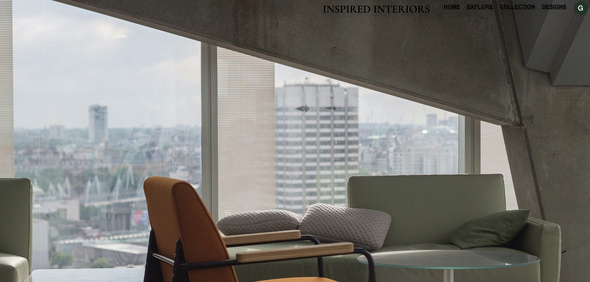

<a name="readme-top"></a>

# INSPIRED INTERIORS 

<details>
  <summary>Table of Contents</summary>
  <ol>
    <li>
      <a href="#about-the-project">About The Project</a>
      <ul>
        <li><a href="#built-with">Built With</a></li>
        <li><a href="#apis-utilized">API's Utilized</a></li>
      </ul>
    </li>
    <li>
      <a href="#getting-started">Getting Started</a>
      <ul>
        <li><a href="#prerequisites">Prerequisites</a></li>
        <li><a href="#installation">Installation</a></li>
      </ul>
    </li>
    <li><a href="#usage">Usage</a></li>
    <li><a href="#whats-next-for-inspired-interiors">What's Next for INSPIRED INTERIORS</a></li>
    <li><a href="#license">License</a></li>
    <li><a href="#contact">Contact</a></li>
  </ol>
</details>

<!-- ABOUT THE PROJECT -->
## About the Project

### [ **WATCH THE DEMO HERE**](https://www.loom.com/share/d2cb126a6bbe4227b5eeaeba2bc0135b)
<br />



This application is an interior design planning and inspiration solution, built to incorporate the critical elements of interior design. 

### Built With

* [![React][React.js]][React-url]
* [![Flask][Flask.com]][Flask-url]
* [![Python][Python.com]][Python-url]
* [![Beautiful Soup][BeautifulSoup.com]][BS4-url]
* [![SQLAlchemy][SQLAlchemy.com]][SQLalchemy-url]
* [![Bootstrap][Bootstrap.com]][Bootstrap-url]
* [![Material UI][MaterialUI.com]][MaterialUI-url]


### API's Utilized
* [Colormind API](http://colormind.io/api-access/)

<p align="right">(<a href="#readme-top">back to top</a>)</p>

## Getting Started


### Prerequisites

* npm 
```sh
  npm install npm@latest -g
  ```
* pipenv
```sh
    pip install pipenv
```
* python - download latest version here <https://www.python.org/downloads/>

<p align="right">(<a href="#readme-top">back to top</a>)</p>

### Installation
1. Fork and Clone the repo
   ```sh
   git clone https://github.com/gnieb/interior-design-board
   ```
2. Create and enter a Virtual Environment
    ```sh
    pipenv install
    ```
    ```sh
    pipenv shell
    ```
3. CD into client directory and install npm packages
    ```sh
    cd client
    ```
    ```sh
    npm install
    ```
4. Start the Front End
    ```sh
    npm start
    ```
5. Start the Server
    ```sh
    cd server
    ```
    ```sh
    python app.py
    ```
    <p align="right">(<a href="#readme-top">back to top</a>)</p>

## Usage

> **Authentication.** A User MUST have an account to use the application. Upon visiting the application, User can sign up for the first time or log into an existing account. 
- Validations used on the domain designer model to ensure user is instantiated with the neccessary information
- **Bcrypt** used to securely encrypt, decrypt, and store password hashes to the database 
- **Formik** used for front-end forms to block invalid information from POST requests and display errors with instructions for users
- **Yup library** used in tandem with Formik to define validation schema
-**useContext** hook used to store the designer state everywhere in the app - I had never used useContext before, but this was extremely useful! I will be using this more in the future!

> **Explore.** The Explore feature brings current trends and design inspiration to the user from an industry classic: Architectural Digest (AD). Users can see the trending articles from AD and click an article to read it at its source ( opens a new tab and takes the reader to the article)
-  When a user navigates to the explore route, a GET request is sent to a custom route in app.py which then invokes the web scraper. The web scraper was built using **beautiful soup ( BS4)** with python. This tool scrapes the trending page, 'AD It Yourself' and pulls Each article along with it's information and returns it to the front end, where the response is displayed for the user as clickable magazine articles. The user can choose any article to view, and when clicked, it will open a new tab in the browser with the article.
- this feature can take a minute to load, as it involves more than one request, so I have created and implmented a loading screen using **react-loading** library and the < ReactLoading /> component which is displayed based on a ternary and whether or not the number of articles is > 0 

> **Profile.** The user (designer) can view their own profile information and can edit some information.
- Full C,R,U actions available for the designer model:
- Designers can be created via Sign Up
- Designers information displayed throughout the site, including association relationships
- Designers can edit their personal information via their profile using a form that sends a PATCH request onSubmit

> **Archive.** Designer can manage pieces in their collection
-C,R,D actions on the Pieces model:
- Designer can view all pieces associated with their account
- Each piece also shows the design or deigns it is associated with, displaying the  many-to-many relationship between the Piece and Design through the PDInstance model.
- Pieces can be created via the collection page with a **Formik** form 
- Designer can delete any piece from the collection
- For easy access, pieces can be filtered by 'Style'  and 'Piece Type' separately or simultaneously

> **Designs.** Designer can view, create, and manage all designs associated with their account. The main design page serves as a container for nested routes which are dynamically rendered. From the main page the designer can either view a design or create a new design.
- Nested routes are rendered using react-router-dom v5 with < Switch /> and < Routes /> 
- Full CRUD actions available for the Design model (see below)
- Designer can create a new design with only a name

> **Design Moodboard** Each Design is displayed as a moodboard, with all pieces associated and the Color palette feature (see Color Palette below). More CRUD actions available for each individual design
- The modboard uses the < Responsive Masonry /> component from the react library to display all pieces in a masonry layout
- Designer can add pieces to their design via the ADD PIECE image with an onClick event which triggers a modal. The modal give the designer three options: 
1. Add an existing piece from their collection! This opens a NEW modal with a collection of images representing their piece collection. Maybe they have something they'd like to use in multiple rooms! (Flexing that has-many-through relationship!) 
2. Add a new piece never before used. This creates a new piece and adds it to both the design, and the Collection
3. Cancel if the designer changes their mind!
- Designer can update the design further: they can remove pieces or rename the room design via  PATCH request
- Designer can delete the design 

> **Color Palette.** The Palette is a tool built using the [Colormind API](http://colormind.io/api-access/). The user can click a button, and a new color palette from the API will be displayed in the palette structure. 
- The front end makes a request to a custom server route which in turn posts a request for a random color palette from the colormind API. The front end translates the rgb to hex and distributes the colors into the pallete structure. 
- The colors are part of the Design model and therefore:
- The color palette is able to be saved when the user finds one they like, and this will persist to the database.
- I have set a default color palette - grayscale- to be displayed upon the creation of a new design as an example for the designer

## Favorite Features

>EXPLORE. Built using beautiful soup, the server scrapes Architectural Digest and brings trending articles to our fingertips. This was the most rewarding stretch goal, although I must note that even during the development of the project, I rebuilt the webscraper to accomodate changes to the Architectural Digest site. I forsee the highest maintenance for this feature

>COLOR PALETTE. The front end makes a request to a server route which in turn posts a request for a random color palette from the colormind API. The front end translates the rgb to hex and distributes the colors into the pallete structure. The color palette is able to be saved when the user finds one they like, and this will persists to the database. 

>LOADING. Implemented in a few locations, the Loading component displays over the page. This was built with the React library: react-loading, and is displayed based on a ternary statement.

>404 Not Found. This page might never be seen by the user, and so I'll shout it out here. This is an aesthetic page that displays anytime the user visits a site on the domain that is not a valid route. The page also has a 'back to safety' button courtesy of react-router-dom's useHistory hook.

<p align="right">(<a href="#readme-top">back to top</a>)</p>

## What's Next for INSPIRED INTERIORS

- More Profile Info and perhaps a location specific feature
- Ability to upload an image! Flask Uploads?
- an About Page // how to use this site => maybe include this on the sign up / login as well for anyone to see what the site is all about

<p align="right">(<a href="#readme-top">back to top</a>)</p>

## Contact

Grace Nieboer
- EMAIL <grace.nieboer@outlook.com>
- [LINKEDIN](https://www.linkedin.com/in/gracenieboer/)
- [INSPIRED INTERIORS](https://github.com/gnieb/interior-design-board)

<p align="right">(<a href="#readme-top">back to top</a>)</p>


<!-- MARKDOWN LINKS & IMAGES -->
<!-- https://www.markdownguide.org/basic-syntax/#reference-style-links -->
[React.js]: https://img.shields.io/badge/React-20232A?style=for-the-badge&logo=react&logoColor=61DAFB
[React-url]: https://reactjs.org/
[Bootstrap.com]: https://img.shields.io/badge/Bootstrap-563D7C?style=for-the-badge&logo=bootstrap&logoColor=white
[Bootstrap-url]: https://getbootstrap.com
[Flask.com]: https://img.shields.io/badge/-FLASK-black?style=for-the-badge&logo=superuser
[Flask-url]: https://flask.palletsprojects.com/en/2.3.x/
[MaterialUI.com]: https://img.shields.io/badge/-MATERIAL%20UI-blue?style=for-the-badge&logo=telegram
[MaterialUI-url]: https://mui.com/
[Python.com]:https://img.shields.io/badge/-Python-black?style=for-the-badge&logo=dependabot
[Python-url]: https://www.python.org/
[BeautifulSoup.com]: https://img.shields.io/badge/-Beautiful%20Soup-pink?style=for-the-badge&logo=gitlab
[BS4-url]: https://beautiful-soup-4.readthedocs.io/en/latest/
[SQLAlchemy.com]: https://img.shields.io/badge/-SQLAlchemy-black?style=for-the-badge&logo=serverfault
[SQLalchemy-url]: https://www.sqlalchemy.org/


