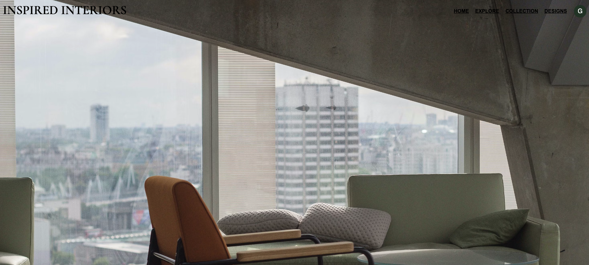

TO DO

- uploads
- push the user to the new design they made after they create it???
- color palette help
- an About Page // how to use this site => maybe include this on the sign up / login 

npm i react-loading => loading bubbles for the explore page


<a name="readme-top"></a>

# INSPIRED INTERIORS 

## ABOUT THE PROJECT
### Link to Project walk-through: [title](https://www.example.com)


### Built With

* [![React][React.js]][React-url]
* [![Flask][Flask.com]][Flask-url]
* [![Python][Python.com]][Python-url]
* [![Beautiful Soup][BeautifulSoup.com]][BS4-url]
* [![SQLAlchemy][SQLAlchemy.com]][SQLalchemy-url]
* [![Bootstrap][Bootstrap.com]][Bootstrap-url]
* [![Material UI][MaterialUI.com]][MaterialUI-url]

## Getting Started

### Prerequisites

* npm 
```sh
  npm install npm@latest -g
  ```
* pipenv
```sh
    pip install pipenv
```
* python - download latest version here <https://www.python.org/downloads/>

### Installation
1. Fork and Clone the repo
   ```sh
   git clone https://github.com/gnieb/interior-design-board
   ```
2. Create and enter a Virtual Environment
    ```sh
    pipenv install
    ```
    ```sh
    pipenv shell
    ```
3. CD into client directory and install npm packages
    ```sh
    cd client
    ```
    ```sh
    npm install
    ```
4. Start the Front End
    ```sh
    npm start
    ```
5. Start the Server
    ```sh
    cd server
    ```
    ```sh
    python app.py
    ```
## Usage


## Contact

Grace Nieboer
- EMAIL <grace.nieboer@outlook.com>
- [LINKEDIN](https://www.linkedin.com/in/gracenieboer/)
- [INSPIRED INTERIORS](https://github.com/gnieb/interior-design-board)

<p align="right">(<a href="#readme-top">back to top</a>)</p>


<!-- MARKDOWN LINKS & IMAGES -->
<!-- https://www.markdownguide.org/basic-syntax/#reference-style-links -->
[React.js]: https://img.shields.io/badge/React-20232A?style=for-the-badge&logo=react&logoColor=61DAFB
[React-url]: https://reactjs.org/
[Bootstrap.com]: https://img.shields.io/badge/Bootstrap-563D7C?style=for-the-badge&logo=bootstrap&logoColor=white
[Bootstrap-url]: https://getbootstrap.com
[Flask.com]: https://img.shields.io/badge/-FLASK-black?style=for-the-badge&logo=superuser
[Flask-url]: https://flask.palletsprojects.com/en/2.3.x/
[MaterialUI.com]: https://img.shields.io/badge/-MATERIAL%20UI-black?style=for-the-badge&logo=telegram
[MaterialUI-url]: https://mui.com/
[Python.com]:https://img.shields.io/badge/-Python-black?style=for-the-badge&logo=dependabot
[Python-url]: https://www.python.org/
[BeautifulSoup.com]: https://img.shields.io/badge/-Beautiful%20Soup-black?style=for-the-badge&logo=gitlab
[BS4-url]: https://beautiful-soup-4.readthedocs.io/en/latest/
[SQLAlchemy.com]: https://img.shields.io/badge/-SQLAlchemy-black?style=for-the-badge&logo=serverfault
[SQLalchemy-url]: https://www.sqlalchemy.org/


